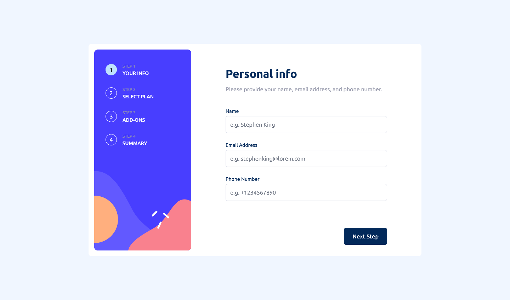

# Frontend Mentor - Multi-step form solution

This is a solution to the [Multi-step form challenge on Frontend Mentor](https://www.frontendmentor.io/challenges/multistep-form-YVAnSdqQBJ). Frontend Mentor challenges help you improve your coding skills by building realistic projects.

## Table of contents

- [The challenge](#the-challenge)
- [Screenshot](#screenshot)
- [Links](#links)
- [Built with](#built-with)
- [Author](#author)

## The challenge

Users should be able to:

- Complete each step of the sequence
- Go back to a previous step to update their selections
- See a summary of their selections on the final step and confirm their order
- View the optimal layout for the interface depending on their device's screen size
- See hover and focus states for all interactive elements on the page
- Receive form validation messages if:
  - A field has been missed
  - A step is submitted, but no selection has been made

### Screenshot

### Links

- Solution URL: [Solution](https://www.frontendmentor.io/solutions/multi-step-form-main-20D_91F2go)
- Live Site URL: [Website](https://multi-step-form-lime.vercel.app/)

### Built with

- Next.js
- Tailwind CSS
- typescript

### Author

- Website - [Mian Azan](https://www.mianazan.com)
- Frontend Mentor - [@mianazan099](https://www.frontendmentor.io/profile/mianazan099)
